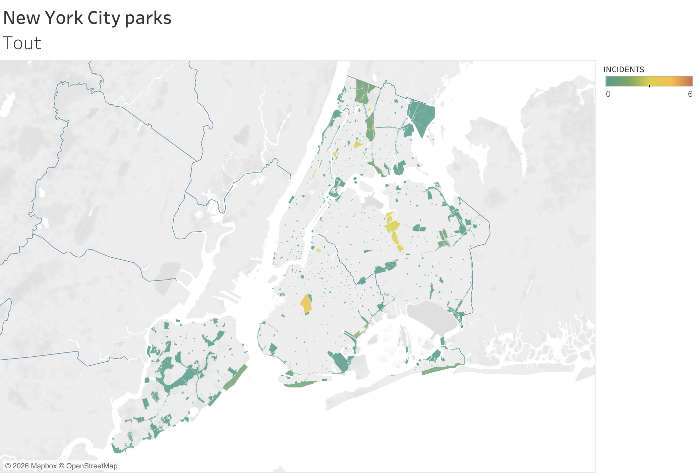

# NYC Parks Safety

## Contexte métier
Un forum communautaire cherche à mobiliser pour davantage de patrouilles 
policières dans les parcs de New York City. Il mandate une analyse des 
incidents criminels signalés au NYPD dans les parcs de la ville au cours 
du premier trimestre 2018 (Central Park exclu).

## Problématique
Quels parcs new-yorkais concentrent le plus d'incidents criminels, 
et comment ces incidents se répartissent-ils par borough ?

## Démarche
- Extraction des données source depuis un fichier PDF
- Jointure avec un fichier de données spatiales contenant 
  le contour réel des parcs (layout et superficie)
- Visualisation cartographique avec code couleur par nombre d'incidents
- Filtre par borough (Bronx, Brooklyn, Manhattan, Queens, Staten Island)
- Tooltips pour identifier chaque parc au survol

## Compétences mobilisées
- Extraction de données depuis un PDF
- Jointure de données tabulaires et spatiales (Spatial Join)
- Cartographie avancée dans Tableau
- Tooltips et filtres interactifs

## Visualisation

🔗 [Voir sur Tableau Public](https://public.tableau.com/views/NYCParksSafety_17729440785740/Sheet1)

## Outils
- Tableau Public

## Données
Données fictives issues d'un exercice pédagogique — incidents NYPD 
Q1 2018, complétées par des données spatiales des parcs de NYC.
